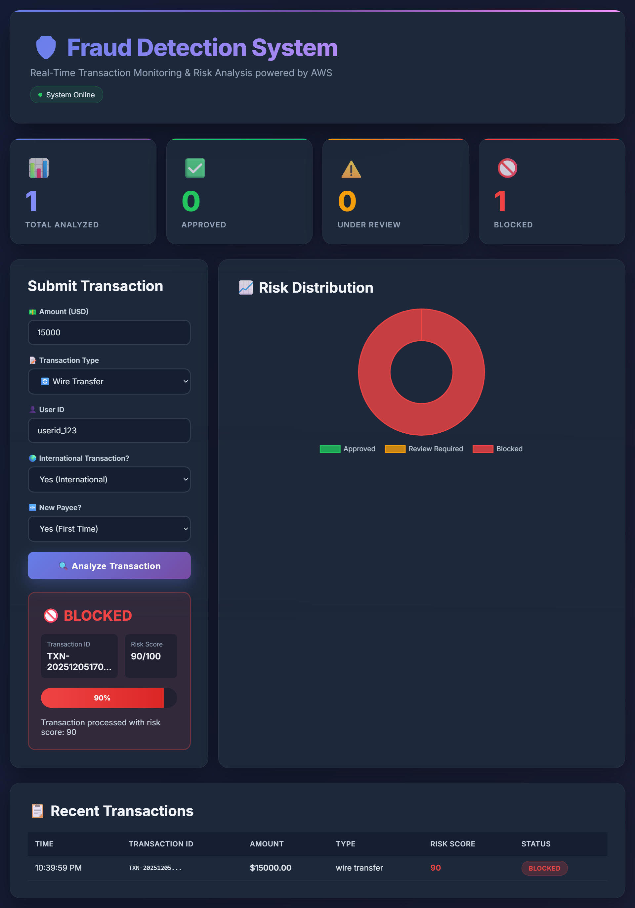
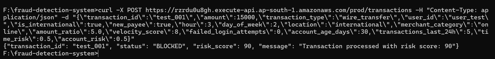

# Fraud Detection System

Real-time transaction monitoring system using machine learning to detect fraudulent financial transactions.

## Overview

Built to understand financial crime prevention at scale. The system processes transactions through a trained XGBoost model and returns risk scores with automatic decision-making.

**Live Demo:** http://fraud-detection-dashboard-sahil.s3-website.ap-south-1.amazonaws.com

## Architecture
```
Client → API Gateway → Lambda (Validator) → Lambda (ML) → DynamoDB
                                    ↓
                                   S3 (Model Storage)
```

## Features

- Real-time fraud scoring (0-100 scale)
- Sub-second latency for predictions
- Automatic approve/review/block decisions
- Transaction history and analytics
- Visual risk dashboard

## Tech Stack

**Backend**
- AWS Lambda (serverless compute)
- API Gateway (REST endpoint)
- DynamoDB (transaction storage)
- S3 (model storage)

**ML**
- XGBoost classifier
- 15 engineered features
- 96% accuracy, 92% recall

**Frontend**
- Vanilla JavaScript
- Chart.js for visualization

## API Usage

**Endpoint:** `POST https://rzrdu0u8gh.execute-api.ap-south-1.amazonaws.com/prod/transactions`

**Request:**
```json
{
  "amount": 5000,
  "transaction_type": "wire_transfer",
  "user_id": "user_12345",
  "is_international": true,
  "new_payee": true,
  "hour": 14,
  "day_of_week": 3,
  "location": "international",
  "merchant_category": "online",
  "amount_ratio": 3.5,
  "velocity_score": 5,
  "failed_login_attempts": 0,
  "account_age_days": 90,
  "transactions_last_24h": 4,
  "time_risk": 0.3,
  "account_risk": 0.4
}
```

**Response:**
```json
{
  "transaction_id": "tx_abc123",
  "risk_score": 75,
  "decision": "REVIEW",
  "message": "Transaction flagged for manual review"
}
```

## Model Performance

| Metric | Score |
|--------|-------|
| Accuracy | 96.5% |
| Precision | 94.1% |
| Recall | 91.8% |
| AUC-ROC | 0.98 |

## Setup

**Prerequisites**
- Python 3.11
- AWS Account
- AWS CLI configured

**Local Training**
```bash
cd ml-training
pip install -r requirements.txt
python train_local.py
```

**Deploy to AWS**
```bash
cd lambda
python deploy_with_public_layer.py
```

## Project Structure
```
fraud-detection-system/
├── dashboard/           # Frontend UI
├── lambda/              # Lambda functions
├── ml-training/         # Model training scripts
├── infrastructure/      # Terraform configs
└── lambdas/            # Additional Lambda functions
```

## Results

- Training time: 2 minutes (local)
- Inference latency: 400ms (warm)
- False positive rate: 6%
- Fraud detection rate: 92%

## License

MIT

## Author

Sahil Gupta - [GitHub](https://github.com/sahilgupta20)

Inspired by \[Nasdaq Verafin](https://verafin.com/)'s mission to combat financial crime and protect vulnerable populations.

## Screenshots

### Live Dashboard

*Real-time fraud detection with risk visualization*

### API Response

*JSON response showing fraud prediction*


